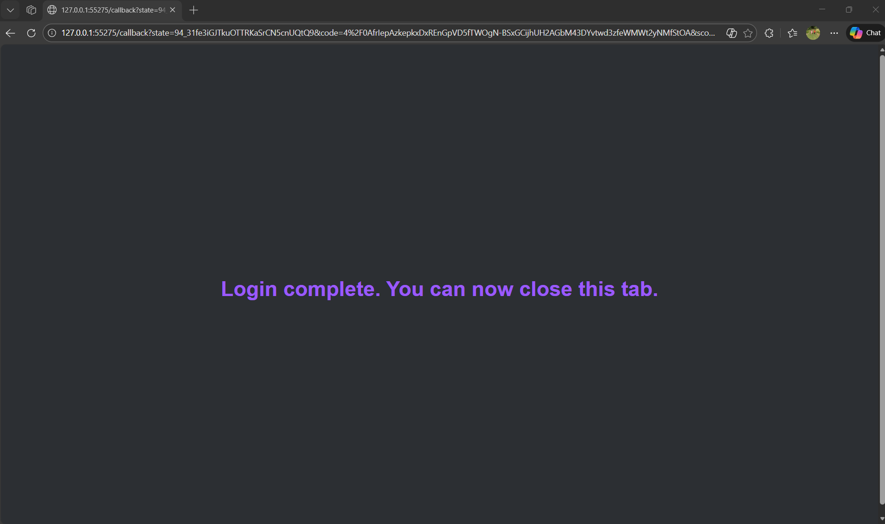
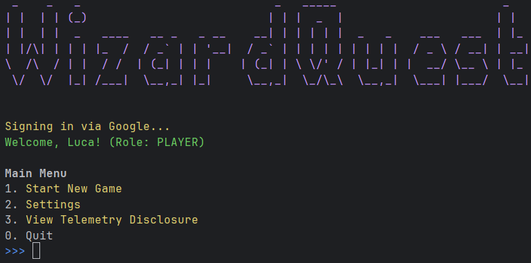

# Testing Evidence

## Automated Test Suite

### Description
The automated test suite for our prototype contains three unit tests and two integration tests. These have been
implemented using JUnit (v5.10.1), and can be executed using a single Maven command - this can be found in our
deployment guide.

These five tests validate the logic of our TelemetryListener class - which is fundamental to the core objective of
what our system aims to achieve. The test suite utilises JUnit's `@TempDir` feature which causes the tests to interact
with temporary JSON files where necessary - this prevents any risk of corruption to the JSON files to be used for
production. The concrete `TelemetryEvent` class primarily used for testing is `NormalEncounterStartEvent` - however, we
have also utilised JUnit's `@BeforeEach` and `@AfterEach` features to invoke a `StartSessionEvent` and `EndSessionEvent`
object before and after each event respectively. This is due to dynamic assignment of the SessionID field.

### Recording

The recording of these tests in execution can be found [here](https://www.youtube.com/watch?v=8MIbzLSoSo8).

## Manual End-to-End Test Suite

### Test 1: Player is authenticated by Google OAuth 2.0 OIDC

#### Recording

The recording of this test can be found [here](https://www.youtube.com/watch?v=J7zUf3znLJk).

#### Screenshots

When the game is run, this is the startup screen that appears in the command line.

This opens a new tab in my default browser, as shown below:

After entering my credentials, I am then shown the following screen indicating login success:

This is reflected in the command line, where I am now clearly signed in.

