# Testing Evidence

## Automated Test Suite

### Description
The automated test suite for our prototype contains three unit tests and two integration tests. These have been
implemented using JUnit (v5.10.1), and can be executed using a single Maven command - this can be found in our
deployment guide.

These five tests validate the logic of our TelemetryListener class - which is fundamental to the core objective of
what our system aims to achieve. The test suite utilises JUnit's `@TempDir` feature which causes the tests to interact
with temporary JSON files where necessary - this prevents any risk of corruption to the JSON files to be used for
production. The concrete `TelemetryEvent` class primarily used for testing is `NormalEncounterStartEvent` - however, we
have also utilised JUnit's `@BeforeEach` and `@AfterEach` features to invoke a `StartSessionEvent` and `EndSessionEvent`
object before and after each event respectively. This is due to dynamic assignment of the SessionID field.

### Recording

TO BE REDONE ONCE ALL AUTOMATED TESTS ARE COMPLETE.

## Manual End-to-End Test Suite

### Test 1: Player is authenticated to game app by Google OAuth 2.0 OIDC

#### Recording

The recording of this test can be found [here](https://youtu.be/W4eMjM-NVRY).

#### Screenshots

From the title screen, click the 'Login with SSO' button.

This opens a new tab in the user's web browser, prompting sign-in with a Google account.

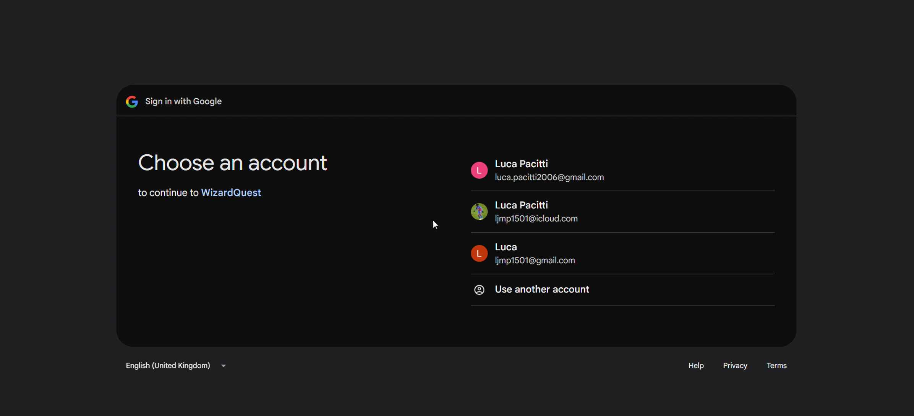

Once signed in, this screen will appear, indicating successful authentication.

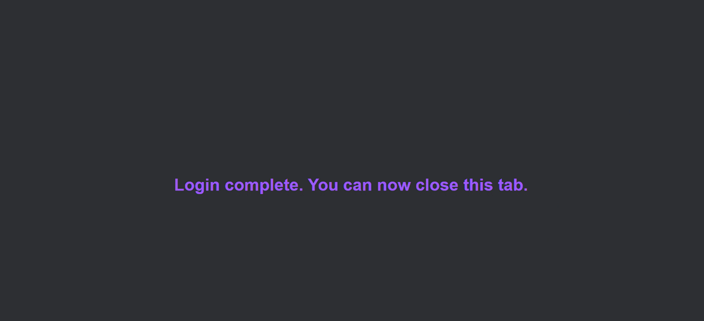

This is reflected in the game app, where the user is now in the game's main menu.

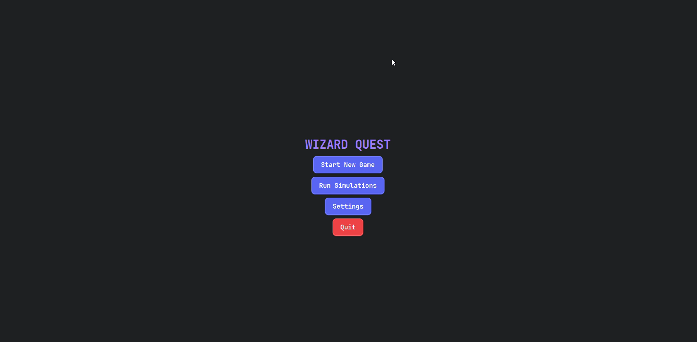

### Test 2: Running game simulations in the game app works correctly

#### Recording

The recording of this test can be found [here](https://youtu.be/181G4iqBl24).

#### Screenshots

Before invoking any simulated runs, we can see that the file 'simulation_events.json' is empty.

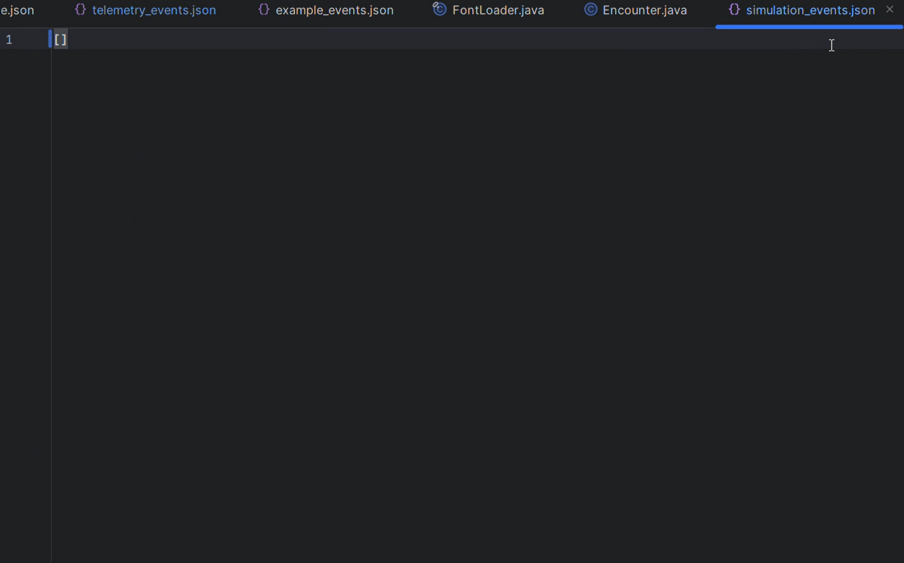

From the main menu, click the 'Run Simulations' button, which produces this pop-up on success.

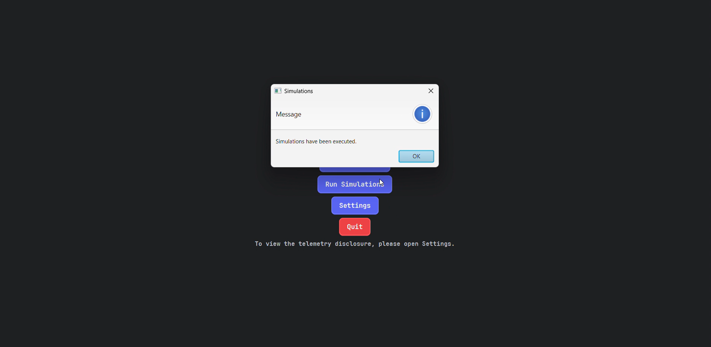

This is reflected in 'simulation_events.json', which is now populated with sequences of telemetry events.

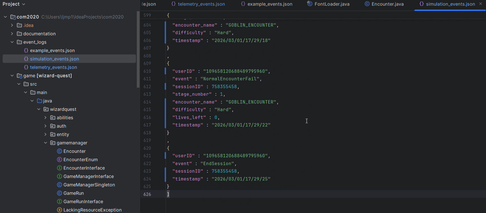

### Test 3: Players cannot change settings parameters in the game app

#### Recording

The recording of this test can be found [here](https://youtu.be/mLBafPQSsVA).

#### Screenshots

From the main menu, click the 'Settings' button.

This opens the following screen, where you can see the user's role of Player displayed at the top.

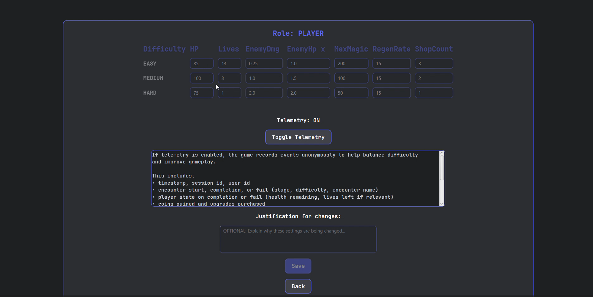

The table of values is greyed out - the user cannot modify these as Players do not have permissions to do so. The same
policy applies to the justification text box.

### Test 4: User can toggle telemetry on and off

#### Recording

The recording of this test can be found [here]().

#### Screenshots

### Test 5: Developers can change settings parameters in the game app

#### Recording

The recording of this test can be found [here](https://youtu.be/RoZk-zCm7o8).

#### Screenshots

From the main menu, click the 'Settings' button.

This opens the following screen, where you can see the user's role of Developer displayed at the top.

Unlike the Player, the table of values and justification box are editable thanks to the user's role of Developer.

Before changing any settings, we can see that the file 'telemetry_events.json' is empty.

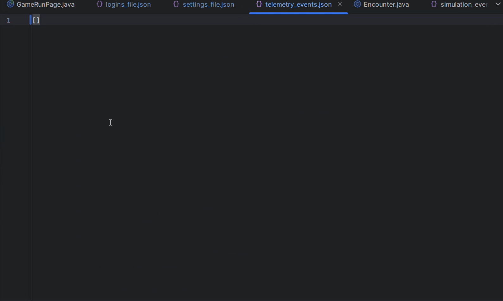

Change the starting lives for the Easy difficulty to 10, and give a placeholder justification.

Clicking the 'Save' button displays the text 'Settings updated', indicating success.

This is reflected in 'telemetry.events.json', where a SettingsChangeEvent with the input setting and justification
has been written.

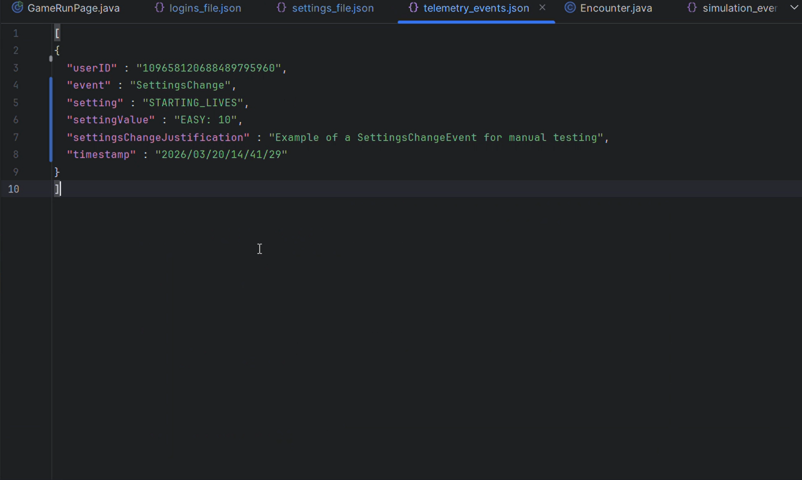

### Test 6: Developers can change the roles of other users in the game app

#### Recording

The recording of this test can be found [here]().

#### Screenshots

### Test 7: Encounter is started and failed with lives remaining

#### Recording

The recording of this test can be found [here](https://youtu.be/ZI6MhQegde0).

#### Screenshots

In this encounter, the user currently has three lives.

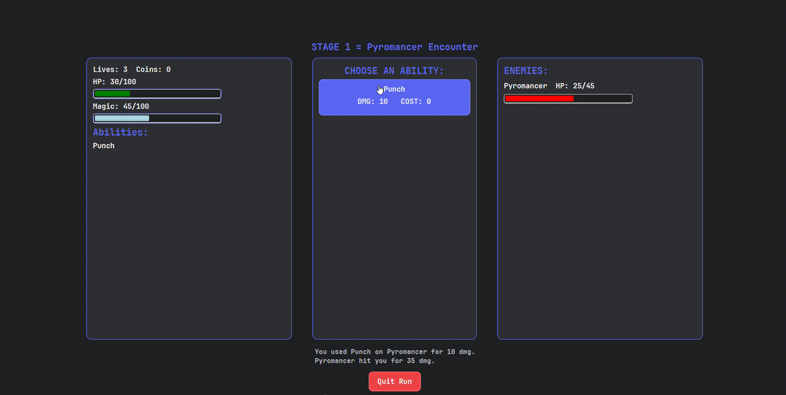

After attacking one another, the user has been defeated by the enemy.

They now have two lives. Their health and magic points, as well as the enemy's health, are also reset.

This is reflected in 'telemetry.events.json', where a NormalEncounterStartEvent and a NormalEncounterFailEvent have
been written one after the other.

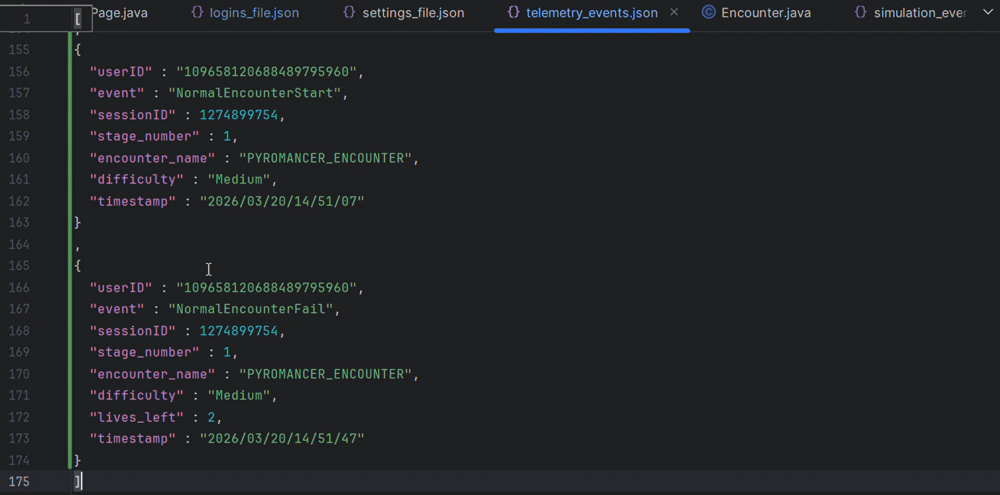

### Test 8: Encounter is failed with no lives remaining

#### Recording

The recording of this test can be found [here]().

#### Screenshots

### Test 9: Encounter is completed

#### Recording

The recording of this test can be found [here]().

#### Screenshots

### Test 10: Only upgrades that are affordable may be purchased in the shop

#### Recording

The recording of this test can be found [here]().

#### Screenshots

### Test 11: Quit Run button ends the current session

#### Recording

The recording of this test can be found [here]().

#### Screenshots

### Test 12: Player authentication to telemetry app is blocked

#### Recording

The recording of this test can be found [here]().

#### Screenshots

### Test 13: Developer is authenticated to telemetry app by Google OAuth 2.0 OIDC

#### Recording

The recording of this test can be found [here]().

#### Screenshots

### Test 14: Designer is authenticated to telemetry app by Google OAuth 2.0 OIDC

#### Recording

The recording of this test can be found [here]().

#### Screenshots

### Test 15: All telemetry app views are functional

#### Recording

The recording of this test can be found [here]().

#### Screenshots

### Test 16: Telemetry data is exported to CSV

#### Recording

The recording of this test can be found [here]().

#### Screenshots

### Test 17: Telemetry data reset wipes the relevant JSON file

#### Recording

The recording of this test can be found [here]().

#### Screenshots

